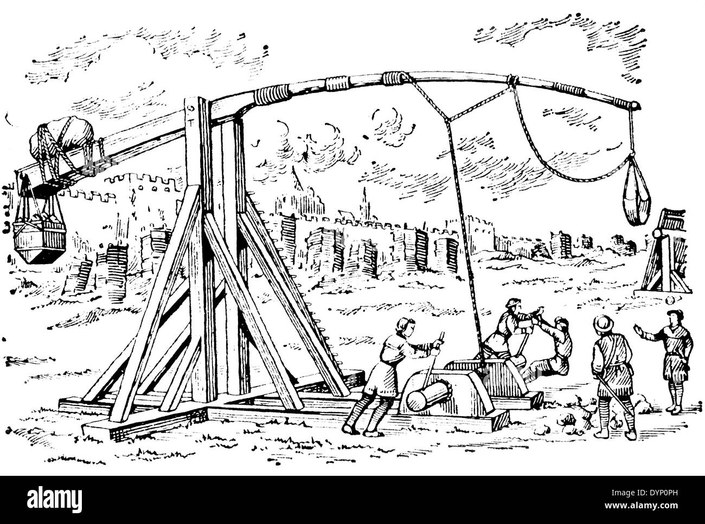

!DOCTYPE
    

 <body>

<h2>PRESENTACIÓN</h2>

Las dimensiones de cada uno de los componentes del fundíbulo determinan el funcionamiento que tendrá el arma. La viga es uno de los elementos cruciales. Debe ser lo más ligera posible, pero lo suficientemente fuerte para no romperse en el disparo. La proporción entre los brazos largo y corto de la viga y la longitud de la honda son factores muy importantes para determinar el alcance que logrará el proyectil. El propósito de un buen diseño es convertir la mayor cantidad posible de la energía potencial del contrapeso en energía cinética para el proyectil. 

<table>
  <caption>TrebuchetV21-Lo quieres? Lo tienes.</caption>
  <colgroup>
    <col span="1" style="background-color:red">
    <col span="2" style="background-color:green">
  </colgroup>
  <tr>
    <th>Presentación</th>
    <th>Proyecto</th> 
    <th>Instalación</th> 
    <th>Instrucciones opreacionales</th>
    <th>Agradecimientos</th> 
  </tr>
  <tr>
    <td>Intruducir</td>
    <td>el</td>
    <td>Contenido</td>
  </tr>
  <tr>
    <td>Este proyecto, ha sido básicamente desarrollado por pura fanfarronería, al principio nadie confiaba y por ello, un ansia por hacer entender que aquí se es capaz de cualquier cosa, dió lugar a una reacción en cadena de operaciones y planteamientos, dignos de edificaciones faraónicas en siglos pasados. Este es el nuevo modelo, la intimidación con intimidación se paga. </td>
    <td>Gimenez</td>
    <td>34</td>
  </tr>
  <tr>
    <td>María</td>
    <td>Ruiz</td>
    <td>87</td>
  </tr>
</table>
       </body>
</html>
